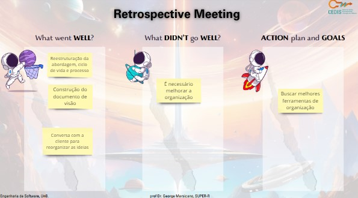

# Ciclo 2

## Data de início e fim do ciclo

*17/09/23* - *23/09/23*

## Ata da reunião

[Baixar ata da reunião em PDF](../atas/18_09_Ata%20.docx.pdf)

[Baixar ata da reunião em PDF](../atas/20_09_Ata.docx.pdf)

## Planning

## Retrospectiva

- Reestruturação da abordagem, ciclo de vida e processo do nosso produto 
- Construção do documento de visão
- Conversa com a nossa cliente para reorganizar nossas ideias 

## Review

Entregas: 
- Criação do git pages 
- Documento de visão
- Documentação da abordagem 
- Entregas da missão 1

## RAD

&emsp;&emsp;Início do Requirements planning, utilização de brainstorm, análise de problema, análise de concorrentes e entrevistas, para uma elicitação de requisitos.
