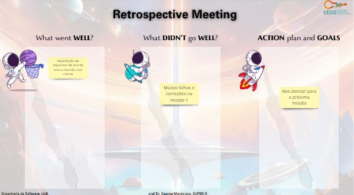
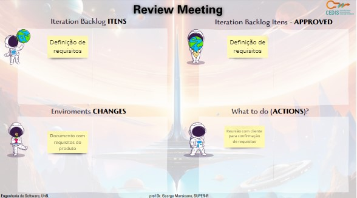

# Ciclo 4

## Data de início e fim do ciclo

*01/10/23* - *07/10/23*

## Ata da reunião

[Documento das funcionalidades](../atas/doc%20.pdf)

## Planning 

## Retrospectiva

- Atualizamos os nossos requisitos que foram previamente elencados
- Reunião com a cliente

## Review

Definimos os requisitos do nosso sistema

## RAD

&emsp;&emsp;Requirements planning: envio do documento de requisitos preliminar para a cliente.

Entregas: 

- Documento de funcionalidades preliminar

Documento dos requisitos preliminares:

  <iframe loading="lazy" style="position: absolute; width: 100%; height: 100%; top: 0; left: 0; border: none; padding: 0;margin: 0;"
    src="https://docs.google.com/document/d/1T9BXybOREkfmF30cXVt7c950gctcX8pqsYj8xEiAxVI/edit" allowfullscreen="allowfullscreen" allow="fullscreen">
  </iframe>

Os requisitos preliminares foram aprovados.

