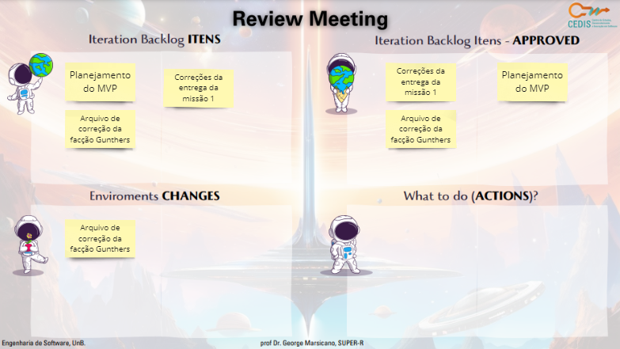

# Ciclo 6

## Data de início e fim do ciclo

*15/10/23* - *21/10/23*

## Planning

## Retrospectiva

- Resolvemos as issues pendentes
- Desenvolvimento do MVP
- Arquivo de correção do Gunters

## Review

## RAD

&emsp;&emsp;User design ciclo 1: Documento de feedback do protótipo de baixa fidelidade.

Entregas:

- Feedback do protótipo de baixa fidelidade
- Planejamento do MVP
- Correções da missão 1

Documento de validação do prototipo de baixa fidelidade:

  <iframe loading="lazy" style="position: absolute; width: 100%; height: 100%; top: 0; left: 0; border: none; padding: 0;margin: 0;"
    src="https://docs.google.com/document/d/1dwnKXBTUo8gTOSqYxIrDxa5ZnPGytsayLh6QeZ61WUE/edit" allowfullscreen="allowfullscreen" allow="fullscreen">
  </iframe>

