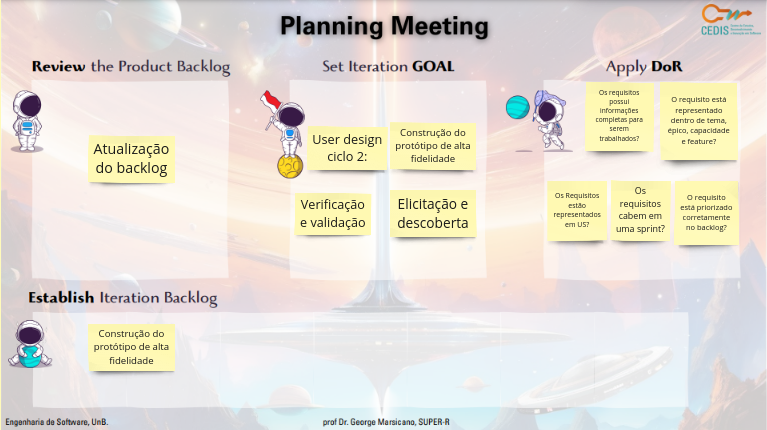
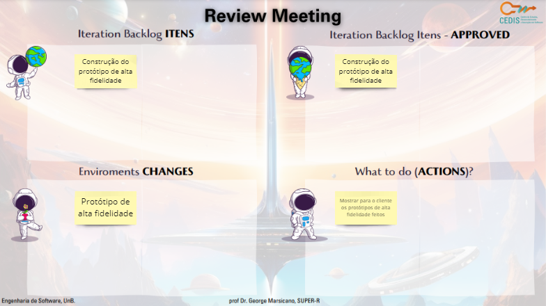
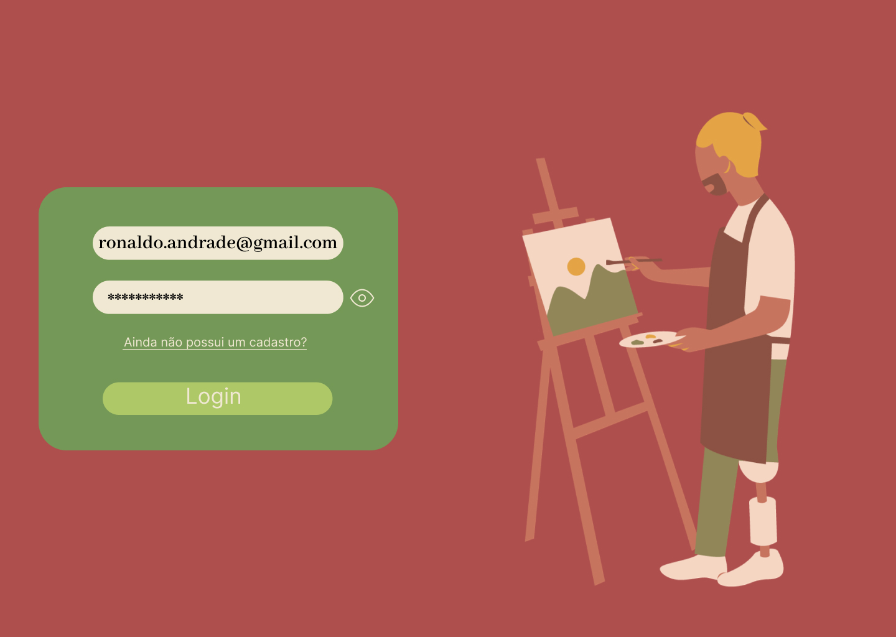

# Ciclo 8

## Data de início e fim do ciclo

*29/10/23* - *04/11/23*

## Planning

## Retrospectiva

- Corrigimos o git pages 
- Fizemos o a verificação e validadação.

## Review

Entregas : 
- Fizemos os prototipo de alta finadelidade  
[Documento do protótipo de alta fidalidade](https://www.figma.com/proto/iLiV02gQO9rTmtNbRC2Ejb/ArtPlace?type=design&node-id=4-2&t=k8IW6HRsnwb6F6H0-0&scaling=min-zoom&page-id=0%3A1&starting-point-node-id=4%3A2) 

