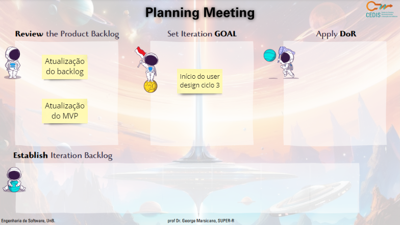
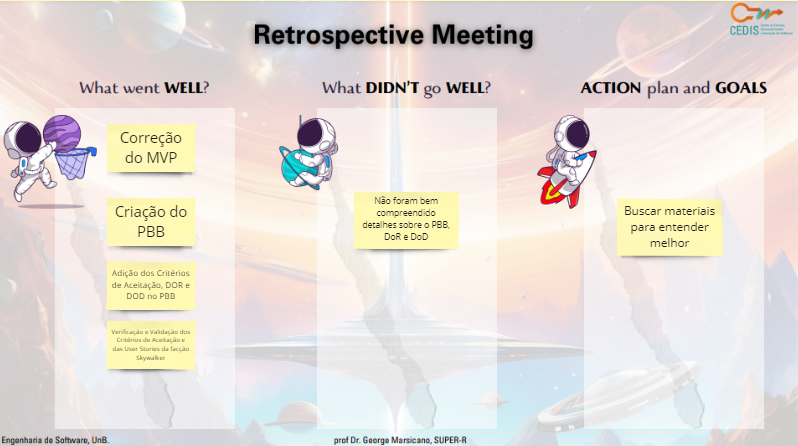

# Ciclo 9

## Data de início e fim do ciclo

*05/11/23* - *11/11/23*

## Planning

## Retrospectiva

- Correção do MVP
- Criação do PBB, critérios de aceitação, DoR e DoD do nosso projeto 
- Verificação e validação das CA e US dos Skywalker

## Review

## RAD

&emsp;&emsp;User design ciclo 2: validação do cliente do protótipo de alta fidelidade.

Entregas:

- O protótipo de alta fidelidade foi aprovado sem ressalvas pelo cliente. 
- [Documento do protótipo de alta fidalidade](https://www.figma.com/proto/iLiV02gQO9rTmtNbRC2Ejb/ArtPlace?type=design&node-id=4-2&t=k8IW6HRsnwb6F6H0-0&scaling=min-zoom&page-id=0%3A1&starting-point-node-id=4%3A2)