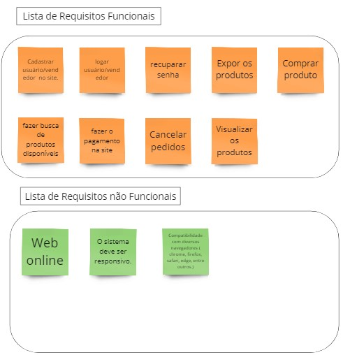
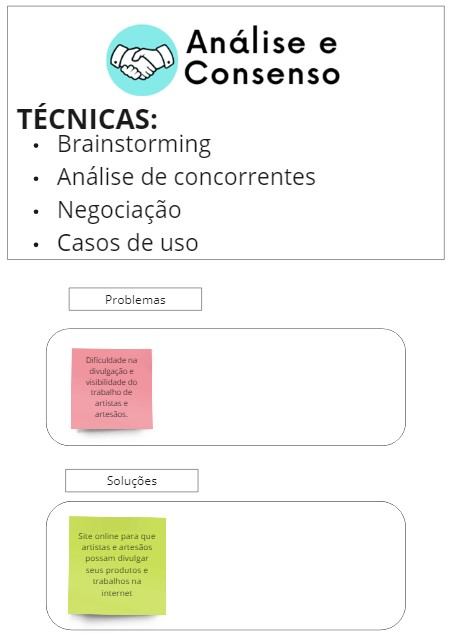
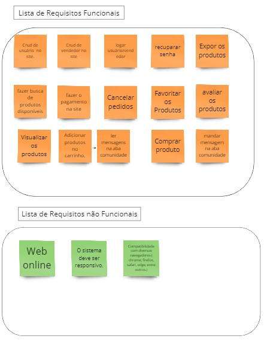
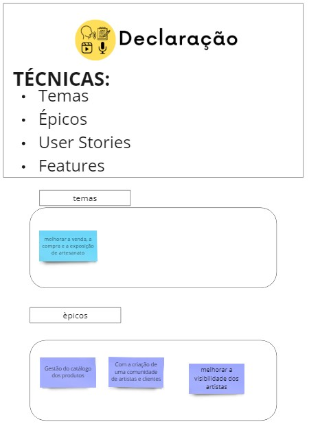
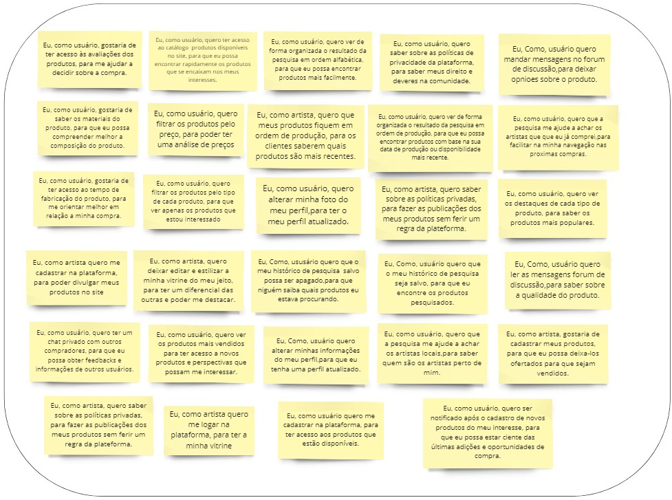
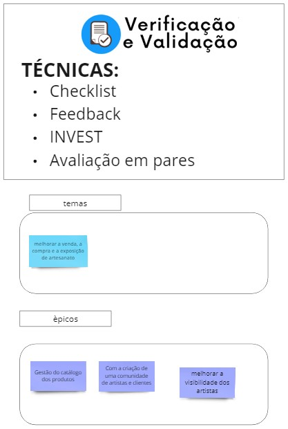
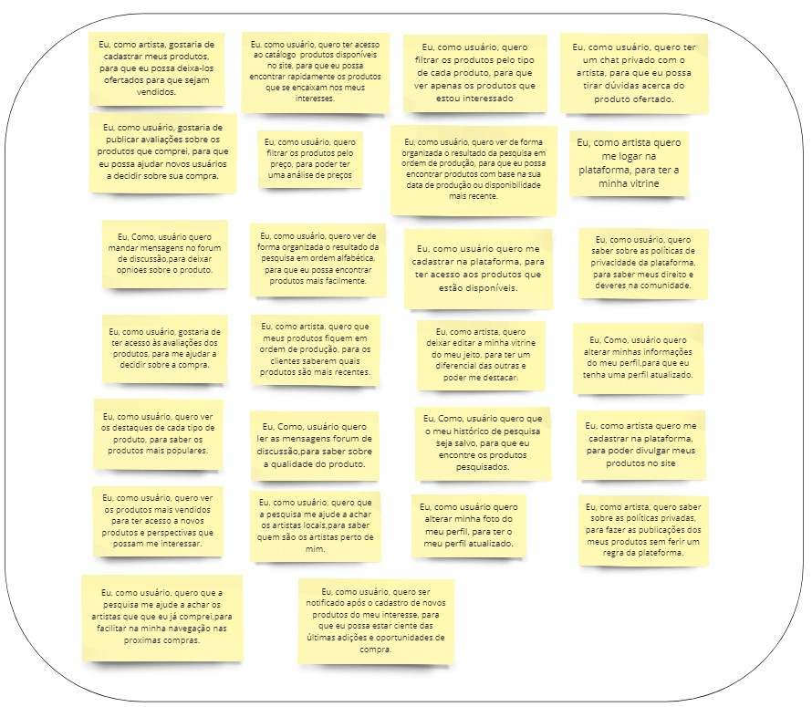

## Safe

O tema da SAFe é melhorar a venda, a compra e a exposição de artesanato e as três tabelas que se seguem são os nossos épicos.

| Épico | Gestão do Catalogo |  |  |  |  |  |  |  |  |
| --- | --- | --- | --- | --- | --- | --- | --- | --- | --- |
| Capacidades | Sistema de pesquisa no catálogo |  |  |  |  | Administração  dos produtos |  |  |  |
| Features | Informar dados de produtos |  | Mostrar os produtos disponíveis |  |  | Pesquisar produtos por filtros |  | Ordenar resultados da pesquisa |  |
| US | Eu, como artista, gostaria de cadastrar meus produtos, para que eu possa deixa-los ofertados para que sejam vendidos. | Eu, como usuário, gostaria de publicar avaliações sobre os produtos que comprei, para que eu possa ajudar novos usuários a decidir sobre sua compra. | Eu, como usuário, quero ter acesso ao catálogo  produtos disponíveis no site, para que eu possa encontrar rapidamente os produtos que se encaixam nos meus interesses. |  | Eu, como usuário, quero ser notificado após o cadastro de novos produtos do meu interesse, para que eu possa estar ciente das últimas adições e oportunidades de compra. | Eu, como usuário, quero filtrar os produtos pelo preço, para poder ter uma análise de preços | Eu, como usuário, quero filtrar os produtos pelo tipo de cada produto, para que ver apenas os produtos que estou interessado | Eu, como usuário, quero filtrar os produtos pelo tipo de cada produto, para que ver apenas os produtos que estou interessado | Eu, como usuário, quero ver de forma organizada o resultado da pesquisa em ordem alfabética, para que eu possa encontrar produtos mais facilmente. |

| Épico | melhorar a visibilidade dos artistas |  |  |  |  |  |  |  |
| --- | --- | --- | --- | --- | --- | --- | --- | --- |
| Capacidades | vitrine dos produtos |  |  |  | aba de pesquisa |  |  |  |
| Features | Gerenciar a minha galeria |  | destaques semanais |  | ter uma melhor pesquisa dos artistas da plataforma |  | manter histórico de pesquisa de produtos |  |
| US | Eu, como artista, quero que meus produtos fiquem em ordem de produção, para os clientes saberem quais produtos são mais recentes. | Eu, como artista, quero deixar editar a minha vitrine do meu jeito, para ter um diferencial das outras e poder me destacar. | Eu, como usuário, quero ver os destaques de cada tipo de produto, para saber os produtos mais populares. | Eu, como usuário, quero ver os produtos mais vendidos para ter acesso a novos produtos e perspectivas que possam me interessar. | Eu, como usuário, quero que a pesquisa me ajude a achar os artistas que que eu já comprei,para facilitar na minha navegação nas proximas compras. | Eu, como usuário, quero que a pesquisa me ajude a achar os artistas locais,para saber quem são os artistas perto de mim. | Eu, Como, usuário quero que o meu histórico de pesquisa seja salvo, para que eu encontre os produtos pesquisados. | Eu, Como, ususário quero que o meu histórico de pesquisa  salvo possa ser apagado,para que niguém saiba quais produtos eu estava procurando. |

| Épico | Com a criação de uma comunidade de artistas e clientes |  |  |  |  |  |  |  |  |  |  |
| --- | --- | --- | --- | --- | --- | --- | --- | --- | --- | --- | --- |
| Capacidades | seguraça e privacidade |  |  |  | Comunicação entre todos os usuários |  |  |  |  |  |  |
| Features | chat privado |  | forum de discussão |  | gerenciamento de conta |  |  |  |  | políticas privadas |  |
| US | Eu, como usuário, quero ter um chat privado com o artista, para que eu possa tirar dúvidas acerca do produto ofertado. | Eu, como usuário, quero ter um chat privado com outros compradores, para que eu possa obter feedbacks e informações de outros usuários. | Eu, Como, usuário quero ler as mensagens forum de discussão,para saber sobre a qualidade do produto. | Eu, Como, usuário quero mandar mensagens no forum de discussão,para deixar opnioes sobre o produto. | Eu, como usuário quero alterar minha foto do meu perfil, para ter o meu perfil atualizado. | Eu, Como, usuário quero alterar minhas informações do meu perfil,para que eu tenha uma perfil atualizado. | Eu, como artista quero me cadastrar na plataforma, para poder divulgar meus produtos no site | Eu, como usuário quero me cadastrar na plataforma, para ter acesso aos produtos que estão disponíveis. | Eu, como artista quero me logar na plataforma, para ter a minha vitrine | Eu, como usuário, quero saber sobre as políticas de privacidade da plataforma, para saber meus direito e deveres na comunidade. | Eu, como artista, quero saber sobre as políticas privadas, para fazer as publicações dos meus produtos sem ferir um regra da plateforma. |

## Backlog

### Elicitação e descoberta

### análise e consenso

### Declaração

### Verificação e validação

### Organização e atualização

Para elaborar a priorização e organização das user stories do backlog foi utilizado um checklist analisando cada US baseada nos critérios de Valor de negócio, viabilidade e complexidade técnica.
Link para acessar a planilha(https://docs.google.com/spreadsheets/d/1wb6GRrLysNB-y3L0VhVegTJRlUkszkBlQ5uTzRttVzs/edit#gid=0)

| US | Valor de Negocio | Viabilidade  | Complexidade Tecnica | Total |
| --- | --- | --- | --- | --- |
| Eu, como usuário quero alterar minha foto do meu perfil,para ter o meu perfil atualizado. | 5 | 4 | 4 | 13 |
| Eu, como usuário, quero ver os produtos mais vendidos para ter acesso a novos produtos e perspectivas que possam me interessar. | 4 | 3 | 3 | 10 |
| Eu, como artista, gostaria de cadastrar meus produtos, para que eu possa deixa-los ofertados. | 5 | 5 | 3 | 13 |
| Eu, como usuário, quero alterar minhas informações do meu perfil,para que eu tenha um perfil atualizado. | 5 | 4 | 4 | 13 |
| Eu, como usuário, quero saber sobre as políticas de privacidade da plataforma, para saber meus direito e deveres na comunidade. | 5 | 5 | 5 | 15 |
| Eu, como usuário, quero ter acesso ao catálogo de produtos disponíveis no site, para que eu possa encontrar rapidamente os produtos que se encaixam nos meus interesses. | 5 | 5 | 4 | 14 |
| Eu, como artista quero me cadastrar na plataforma, para poder divulgar meus produtos no site | 5 | 5 | 3 | 13 |
| Eu, como artista, quero saber sobre as políticas privadas, para fazer as publicações dos meus produtos sem ferir um regra da plateforma. | 5 | 5 | 5 | 15 |
| Eu, como usuário quero me cadastrar na plataforma, para ter acesso aos produtos que estão disponíveis. | 5 | 5 | 3 | 13 |
| Eu, como artista, quero me logar na plataforma, para ter a minha vitrine | 5 | 5 | 4 | 14 |
| Eu, como usuário, gostaria de publicar avaliações sobre os produtos que comprei, para que eu possa ajudar novos usuários a decidir sobre sua compra. | 5 | 4 | 3 | 12 |
| Eu, como usuário, gostaria de ter acesso às avaliações dos produtos, para me ajudar a decidir sobre a compra. | 5 | 4 | 4 | 13 |
| Eu, como usuário, quero filtrar os produtos pelo tipo de cada produto, para que ver apenas os produtos que estou interessado | 5 | 3 | 2 | 10 |
| Eu, como usuário, quero que a pesquisa me ajude a achar os artistas que que eu já comprei, para facilitar na minha navegação nas proximas compras. | 3 | 2 | 2 | 7 |
| Eu, como usuário, quero ver os destaques de cada tipo de produto, para saber os produtos mais populares. | 5 | 3 | 2 | 10 |
| Eu, como usuário, quero ter um chat privado com outros compradores, para que eu possa obter feedbacks e informações de outros usuários | 4 | 2 | 1 | 7 |
| Eu, como usuário, quero ler as mensagens fórum de discussão,para saber sobre a qualidade do produto. | 5 | 3 | 2 | 10 |
| Eu, como artista, quero que meus produtos fiquem em ordem de produção, para os clientes saberem quais produtos são mais recentes | 3 | 2 | 2 | 7 |
| Eu, como usuário, quero filtrar os produtos pelo preço, para poder ter uma análise de preços | 5 | 3 | 3 | 11 |
| Eu, como artista, quero editar a minha vitrine do meu jeito, para ter um diferencial das outras e poder me destacar. | 4 | 2 | 3 | 9 |
| Eu, como usuário, quero ver de forma organizada o resultado da pesquisa em ordem alfabética, para que eu possa encontrar produtos mais facilmente. | 4 | 4 | 3 | 11 |
| Eu, como usuário, quero ser notificado após o cadastro de novos produtos do meu interesse, para que eu possa estar ciente das últimas adições e oportunidades de compra. | 4 | 1 | 2 | 7 |
| Eu, como usuário, quero ver de forma organizada o resultado da pesquisa em ordem de produção, para que eu possa encontrar produtos com base na sua data de produção ou disponibilidade mais recente. | 3 | 3 | 2 | 8 |
| Eu, como, usuário quero mandar mensagens no forum de discussão,para deixar opinioes sobre o produto. | 1 | 1 | 1 | 3 |
| Eu, como usuário, quero que o meu histórico de pesquisa seja salvo, para que eu encontre os produtos pesquisados. | 1 | 1 | 1 | 3 |
| Eu, como usuário, quero que o meu histórico de pesquisa  salvo possa ser apagado, para que ninguém saiba quais produtos eu estava procurando. | 1 | 1 | 1 | 3 |
| Eu, como usuário, quero que a pesquisa me ajude a achar os artistas locais, para saber quem são os artistas perto de mim. | 1 | 1 | 1 | 3 |
| Eu, como usuário, quero ter um chat privado com o artista, para que eu possa tirar dúvidas acerca do produto ofertado. | 1 | 1 | 1 | 3 |

