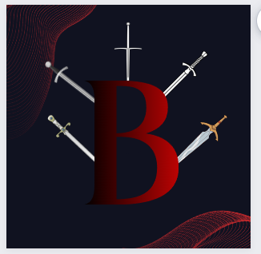

# Berserk

## História 
Em um canto remoto e esquecido do vasto universo, seis almas destemidas — Zara, Lorian, Yondu, Eclipse, Zinum e Marsicano Junior — cruzaram seus caminhos em um momento predestinado. Cada um deles carregava a dolorosa lembrança das crueldades impiedosas perpetradas pelo ganancioso Conglomerado Apache, uma corporação que explorava impiedosamente planetas inteiros, deixando a miséria em seu rastro e demonstrando total desconsideração pelo bem-estar de suas populações. Movidos por uma determinação incansável de fazer justiça em nome daqueles que haviam sofrido, eles uniram suas habilidades e convicções para formar uma facção de mercenários destemidos, batizada de Berserk.

O objetivo primordial dos Berserk era cristalino: destruir o Conglomerado Apache e pôr um fim à sua tirania desenfreada, custasse o que custasse. Com suas habilidades únicas e uma motivação inabalável, lançaram-se em uma série de operações arriscadas, minando persistentemente o domínio da poderosa corporação. Zara liderava com bravura e uma experiência formidável em combate, enquanto Lorian contribuía com astúcia e habilidades táticas. Yondu, inabalável em sua determinação, trazia consigo perícia inigualável em combate. Eclipse, com maestria em tecnologia e estratégia, era uma peça vital. Zinum, com seu conhecimento da tecnologia ancestral, agregava um elemento singular. Marsicano Junior, com seu carisma cativante e habilidades de liderança, mantinha os ânimos da equipe elevados.

### História dos membros 

#### Fause

#### Guilherme - Eclipse

Ethan Korrigan, também conhecido como "Eclipse," nasceu em Verdantia, um planeta outrora exuberante que foi transformado em um deserto tóxico pela ganância insaciável da Corporação Slitherium. Sua infância foi uma época marcada por ruínas e perigos constantes, especialmente quando seu planeta natal foi dizimado pela corporação impiedosa. No entanto, sua família perseverou, e Ethan se tornou um guerreiro habilidoso, emergindo como um líder na resistência contra a Slitherium.

Com a determinação forjada nas chamas da adversidade, Eclipse compreendeu a importância da união na luta contra a tirania corporativa. A cada batalha travada, ele se aproximava de seu objetivo final: a completa destruição da Slitherium e a restauração da justiça em sua galáxia devastada. Sua missão não era apenas uma batalha física, mas uma luta pela alma da galáxia, uma jornada que o levou por todo o caminho das estrelas em busca de vingança e redenção. Eclipse se tornou uma lenda, um símbolo de esperança para os oprimidos, um raio de luz nas trevas que iluminava o caminho para um futuro mais justo.

#### Pedro Cabeceira - Zara
Em uma galáxia distante, Zara, um habilidoso guerreiro nativo do deslumbrante planeta Vionia, emergiu como uma figura lendária. Seu destino foi selado quando uma sombra tenebrosa, os Drakarianos, começou a ameaçar seu lar e a galáxia que ele tanto amava. Com habilidades incomparáveis em artes marciais e uma determinação inabalável, Zara reuniu um grupo de aliados leais e engajou-se em uma batalha épica para proteger sua pátria e garantir a sobrevivência de sua galáxia.

Anos de conflito feroz se seguiram, com Zara e sua equipe enfrentando os Drakarianos em uma série de batalhas que testaram os limites de sua coragem e resistência. A guerra culminou em uma vitória heroica, com os Drakarianos sendo derrotados e a galáxia de Vionia salva. No entanto, Zara sabia que seu dever estava longe de terminar. Convicto de que ameaças intergalácticas podiam surgir em qualquer lugar, ele embarcou em uma jornada intergaláctica, navegando pelo vasto cosmos a bordo de uma nave espacial avançada.

As aventuras de Zara o levaram a inúmeras galáxias, onde encontrou civilizações diversas, algumas pacíficas, outras ameaçadoras. Em cada encontro, ele buscava a paz e a justiça, defendendo os oprimidos e enfrentando aqueles que ameaçavam a harmonia do universo. Com o tempo, Zara se tornou uma lenda viva, seu nome reverberando em todos os cantos do espaço como um símbolo de esperança e coragem. À medida que continuava a enfrentar desafios cósmicos e desvendar mistérios intergalácticos, seu legado inspirou gerações futuras a seguir seus passos na defesa da paz e da justiça, tornando-o o guardião incansável das galáxias, pronto para enfrentar as trevas e trazer a luz onde quer que fosse necessário.

#### Pedro Muniz - Zinum
Zinum, um destemido nativo do planeta arrasado pela ganância da Corporação Slitherium, teve uma infância marcada pela desolação de seu lar e pela opressão de uma corporação cruel. Seu pai, um homem corajoso, foi forçado a trabalhar nas minas exploradas pela Slitherium, onde o ambiente tóxico era apenas uma parte dos horrores que enfrentava diariamente. Porém, o destino de Zinum mudou para sempre quando seu pai fez uma descoberta surpreendente nas profundezas das minas: um artefato de tecnologia ancestral.

A descoberta desse artefato se tornou uma maldição, pois chamou a atenção da Spark Tech, uma organização rival da Slitherium, determinada a manter a tecnologia ancestral em segredo. Agentes da Spark Tech perseguiram implacavelmente o pai de Zinum, levando à tragédia quando ele foi assassinado em sua busca por respostas. Esse evento trágico forjou uma determinação feroz em Zinum, transformando-o em um guerreiro impiedoso que jurou vingar a morte de seu pai e garantir que a verdade sobre a tecnologia ancestral fosse revelada.

Assim, Zinum se tornou uma figura proeminente na resistência contra a opressão das corporações, liderando a luta não apenas pelo seu planeta natal, mas também para desvendar os segredos por trás da tecnologia ancestral e garantir que ela não fosse usada para fins nefastos. Sua jornada o levou a explorar planetas distantes, enfrentar inimigos poderosos e descobrir segredos que poderiam mudar o destino de sua galáxia. A busca por justiça e vingança tornou-se uma missão incansável para Zinum, que estava determinado a honrar a memória de seu pai e libertar seu planeta da opressão implacável das corporações intergalácticas.

#### Rafael - Lorian

Lorian nasceu e cresceu em uma família de aldeões que enfrentava dificuldades constantes para sobreviver. Seus sonhos eram preenchidos com o desejo de uma vida mais confortável, com refeições abundantes e um lar aconchegante. No entanto, a realidade implacável da aldeia era um obstáculo insuperável para essas aspirações. A cada dia, Lorian testemunhava a luta incansável de sua família e vizinhos pela subsistência, mas isso apenas aumentava sua determinação em encontrar uma maneira de superar as adversidades e criar um futuro melhor para si mesmo e para aqueles ao seu redor.

#### Renan - Yondu

Yondu, um guerreiro atormentado pela perda de sua família durante uma guerra cruel promovida pelo implacável grupo Apache, jurou vingança contra aqueles que haviam destruído sua vida. Determinado a aprimorar suas habilidades, ele se tornou um mercenário, dedicando-se a se tornar um combatente formidável para alcançar seu objetivo final: destruir cada um dos CEOs do Conglomerado Apache.

A jornada de Yondu era uma busca implacável por justiça, uma saga que o levaria a enfrentar desafios terríveis em sua luta incansável para erradicar o mal que havia destruído sua família e mudado sua vida para sempre. Enquanto o Apache existisse, sua busca por vingança nunca cessaria, e ele estava disposto a fazer o que fosse preciso para acabar com a tirania e a crueldade do conglomerado que havia arruinado sua vida.

### Compromisso 

Nós, os Berserk, mantemos um compromisso inabalável com o Comando Estelar. Juntos, compartilhamos a missão de proteger os indefesos, garantir o bem-estar dos povos planetários e enfrentar a opressão do Conglomerado Apache. Nossa parceria fornece recursos, informações e estratégias para desafiar a corporação gananciosa, tornando-nos uma força temida e uma esperança para um universo mais justo.

### Importância 

A maior importância dos Berserk na luta contra o Conglomerado Apache está em nossa coragem inabalável, habilidades diversas e na inspiração que oferecemos. Não recuamos diante dos desafios e estamos dispostos a enfrentar batalhas arriscadas. Cada um de nós traz habilidades únicas, tornando-nos uma equipe versátil. Inspiramos outros a se levantarem contra a opressão e desafiamos a opulência corporativa, destacando a necessidade de justiça e igualdade. Nossa colaboração com o Comando Estelar proporciona recursos e apoio estratégico para uma resistência sustentável contra o Conglomerado Apache. Em resumo, somos a voz da resistência e da esperança em um universo mais justo.

