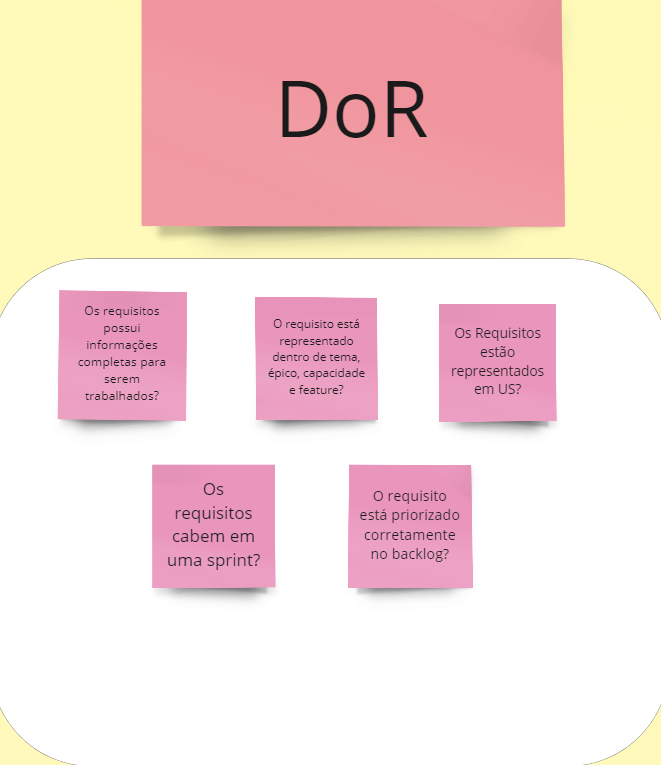

## DOD

O conceito de DOD (Definition of Done), ou traduzindo definição de feito, ajuda o time a elencar os pontos necessários para que uma determinada tarefa seja classificada como concluída. Não existe uma definição de pronto oficial que deve ser seguida por todas as organizações e equipes de desenvolvimento, até porque, cada produto tem sua complexidade. Cada equipe deve desenvolver sua definição de pronto, levando sempre em consideração o desafio do produto, as ferramentas tecnológicas que estão sendo utilizadas, as necessidades dos usuários e etc.

Escolhemos como DOD essas questões a baixo:

## DOR

O DOR, trata-se de uma listagem de requisitos que determinada história ou tarefa necessita para que possa estar apta a entrar no backlog da Sprint. Normalmente essa lista fica vinculada a tarefa e cada item é marcado com check se está atendido ou não. 

## Visualização pelo Miro

<iframe width="768" height="432" src="https://miro.com/app/live-embed/uXjVNeUBBRc=/?moveToViewport=84281,4356,5125,5219&embedId=53442890266" frameborder="0" scrolling="no" allow="fullscreen; clipboard-read; clipboard-write" allowfullscreen></iframe>