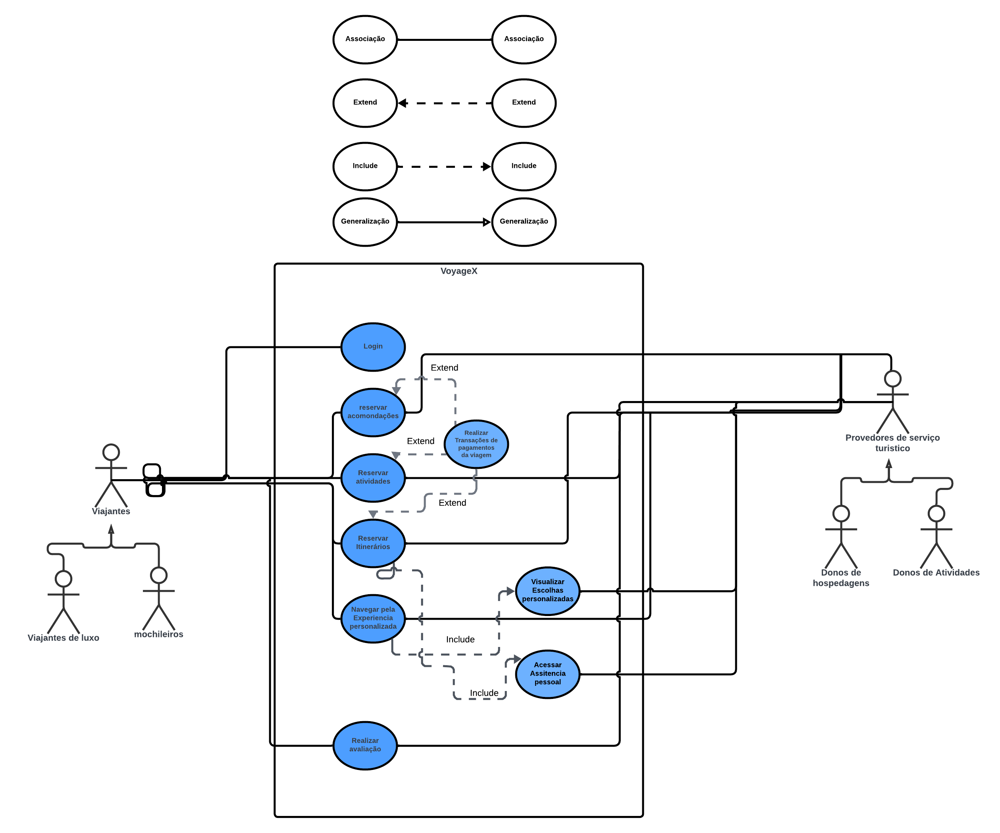

# Casos de uso 

## Diagrama dos casos de uso 

&emsp;&emsp;Um diagrama de casos de uso é uma representação gráfica que descreve as interações entre um sistema e seus usuários. Nele, atores (usuários ou sistemas externos) são ligados a casos de uso (funcionalidades do sistema). Esses diagramas ajudam a compreender e documentar os requisitos funcionais do sistema, sendo úteis na comunicação entre desenvolvedores e stakeholders durante a análise de requisitos e abaixo é possivel visualizar o diagram realizado pela facção berserk.
 

## Especificação dos casos de uso