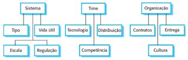
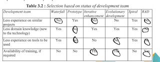
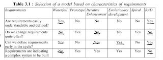
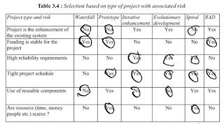
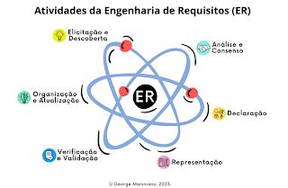
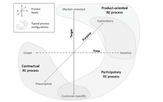

# Abordagem e ciclo de vida

Para escolher a abordagem para o desenvolvimento desse projeto, foram utilizados os critérios propostos

por Sommerville (2018), respondendo a uma série de perguntas de três naturezas:

-  **Técnicas:** Relacionam-se com o sistema que está sendo desenvolvido.

-  **Humanas:** Relacionam-se com o time de desenvolvimento.

-  **Organizacionais:** Relacionam-se com a organização que está desenvolvendo e/ou adquirindo esse sistema.

A seguir, serão discriminadas e respondidas essas perguntas de acordo com as especificidades do projeto.

### Questões TÉCNICAS:

1. Qual é o tamanho do sistema que está sendo desenvolvido?

    -É um sistema de pequeno porte.

2. Que tipo de sistema está sendo desenvolvido?

    -Uma aplicação Web para primariamente exposição e venda de peças artesanais.

3. Qual é a vida útil prevista para o sistema?

    -Média a longa duração.

4. O sistema está sujeito a controle externo?

    -Não.

### Questões HUMANAS:

1. Qual é o nível de competência dos projetistas e programadores do time de desenvolvimento?

    -Os participantes da equipe de desenvolvimento possuem alguma experiência prévia com outros projetos e conhecimentos variados em várias áreas do desenvolvimento de software, porém alguns podem não ter o conhecimento de todas as ferramentas.

2. Como está organizado o time de desenvolvimento?

  

    -O time inicialmente conta com 6 pessoas, cada uma designada a funções que possuem inicialmente mais afinidade, porém é um objetivo do desenvolvimento que todos participem da maioria das atividades.

3. Quais são as tecnologias disponíveis para apoiar o desenvolvimento do sistema?

    -Tecnologias definidas anteriormente no tópico específico para elas.

### Questões ORGANIZACIONAIS:

1. É importante ter uma especificação e um projeto (design) bem detalhados antes de passar para a implementação — talvez por motivos contratuais?

    -Não, o sistema deve ser construído conforme novas necessidades e requisitos forem definidos pelo cliente após cada feedback.

2. É realista uma estratégia de entrega incremental, na qual o software é entregue aos clientes ou outros stakeholders e um rápido feedback é obtido?

    -Sim, para uma melhor compreensão das necessidades e objetivos do cliente é interessante uma entrega incremental obtendo o feedback constantemente. E dada a proximidade do cliente com o time de desenvolvimento essa é sim uma estratégia realista.

3. Os representantes do cliente estarão disponíveis e dispostos a participar do time de desenvolvimento?

    -Não, os responsáveis pelo desenvolvimento são apenas a equipe já definida para o projeto, porém o cliente se encontra disponível para reuniões com esse time e o fornecimento de feedbacks acerca do produto.

4. Existem questões culturais que possam afetar o desenvolvimento do sistema?

    -Não.

Baseado nessas respostas, a abordagem definida é a ágil. E visando a entrega de um produto com mais qualidade possível, o ciclo de vida será iterativo e incremental, focando o desenvolvimento em entregas curtas para que se obtenha feedbacks rápidos do cliente e se possa desenvolver uma solução que atenda bem às necessidades e os requisitos esperados.

# Processo

Para definir o processo para o desenvolvimento do software foi utilizado os critérios propostos por Gupta respondendo sobre as características dos requisitos, equipe, usuário e riscos do projeto nas tabelas propostas:

Após a análise do método e também tendo em vista as definições da abordagem e do ciclo de vida, o processo definido para o projeto foi o RAD (Rappid aplication development). Favorecendo o feedback rápido do cliente, e centrando o desenvolvimento no usuário e no design de produto.

# Engenharia de requisitos

A engenharia de requisitos de acordo com a ISO-IEC-IEEE 29148 consiste em uma área interdisciplinar da engenharia de software que tem o objetivo de fazer a conexão entre as necessidades do adquirente ou cliente com o desenvolvedor, de forma a estabelecer os requisitos de um sistema, produto de software ou serviço. Em outras palavras, é a área da engenharia de software centrada no ser humano e seus problemas e visa por meio de ciências sociais e cognitivas realizar a ponte entre as necessidades reais do usuário e o desenvolvedor, gerando um produto final mais satisfatório e que de fato atenda aos requisitos propostos.

De acordo com George Marsicano(2023) a engenharia de requisitos pode ser dividida em algumas atividades:

-  **Elicitação e descoberta:** Consiste em extrair, obter ou provocar uma resposta ou informação de alguém ou de algo, e encontrar algo que antes não era conhecido ou não estava disponível.

-  **Análise e consenso:** Consiste em analisar os requisitos em sua forma bruta e conciliar as diversas fontes de informação a um entendimento comum na definição do conjunto de requisitos.

-  **Declaração:** É o ato de comunicar os requisitos entre os envolvidos declarando os requisitos funcionais e não funcionais.

-  **Representação:** Envolve a apresentação dos requisitos em modelos, podendo esses serem informais, semi formais ou formais.

-  **Verificação e validação:** Diz respeito a qualidade dos requisitos. A validação envolve a qualidade externa, e visa garantir que os requisitos definem a solução correta de acordo com a definição das partes interessadas. A verificação tem a ver com a qualidade interna, e confirma se os requisitos foram realizados de maneira correta.

-  **Organização e atualização:** A organização se refere à maneira de como os requisitos serão estruturados, rastreados, refinados e priorizados. Já a atualização foca em manter a organização dos requisitos sempre no estado mais atual conforme atualizações entre as fontes de requisitos.

Dada esses conceitos é necessário definir o processo de engenharia de requisitos que mais se encaixa no nosso projeto, e para isso foi utilizado o método proposto pelo Handbook IREB CPRE foundation Level, Requirements Engineering de Martin Glinz (2019), no qual define as configurações típicas do processo de engenharia de requisitos baseando-se na definição de facetas específicas de alvo, propósito e tempo do projeto.

Para nosso projeto ficaram definidos:

  -  **Alvo:** Específico do cliente, ou seja, o sistema será desenvolvido para um cliente o qual será a principal fonte de requisitos.

-  **Propósito:** Exploratório, pois tem objetivos definidos, mas será necessário explorar mais os requisitos com o cliente.

-  **Tempo:** Interativo, já que os requisitos estarão em evolução e será obtido feedback rápido do cliente conforme os ciclos de iteração.

Tendo em vista essas definições, o processo de engenharia de requisitos escolhido é o participativo, com forte envolvimento entre as partes interessadas, feedback constante e integração contínua.

  

# Tabela de atividades

| Nome da atividade| Método | Ferramenta | Entrega |
|------------|-----------|------------|-----------|
| Elicitação e descoberta | Brainstorming | Teams | Bate papo entre a equipe e o cliente para definir as informações |
| Análise e consenso | Brainstorming | Teams | Bate papo da equipe como cliente para realizar sugestões e entrar em um consenso dos requisitos |
| Declaração | Épicos, features,Histórias de usuário | Googles docs, Git pages,miro | Listar de forma clara os requisitos definidos |
| Organização e atualização | Backlog,Historia de usuario | Git pages, miro | Acompanhamento e organização dos requisitos |
| Representação | Prototipagem | Figma,miro,paint | Apresentação de uma simulação dos requisitos de forma visual |
| Verificação e validação | Checklist,Feedback,e análise dos requisitos | Miro,google docs | Lista de requisitos alinhada com os objetivos do produto |

## materiais

Para entender nossas esclhas de abordagens, ciclo de vida, processo e fecetas da engenharia de requisitos clique [Aqui](https://www.canva.com/design/DAFvevC6f3Q/ASfVgNZw5fJUGiSlEAoCIQ/edit?referrer=powerpoint-alternative-landing-page).
