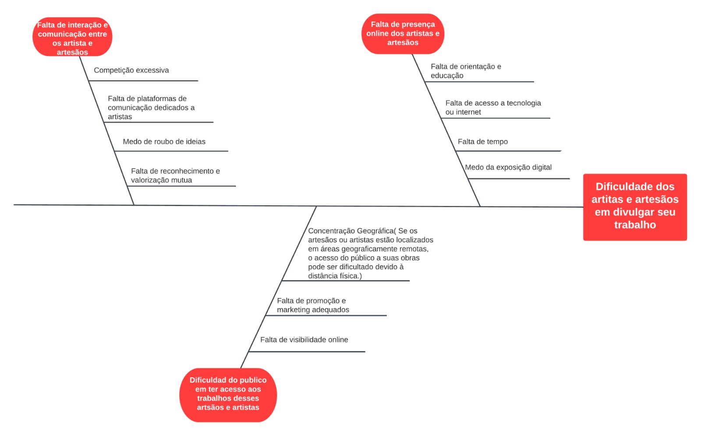

# visão geral produto

## 1.1 Problema

Hoje em dia, um dos grandes problemas enfrentados por artesãos e criadores de seu próprio trabalho é a forma de divulgar seu trabalho. Mesmo existindo plataformas com funcionalidades semelhantes, como Amazon, Shopee e outros e-commerces, esses sistemas não têm o foco voltado para aqueles que criam seu próprio trabalho. Além disso, eles impõem altas taxas aos usuários para manterem seus produtos expostos no site, bem como uma parcela que é cobrada nas vendas. Essas taxas serão muito mais acessíveis no ArtPlace.

## 1.2 Declaração de Posição do Produto

O ArtPlace será desenvolvido com foco nas necessidades dos clientes, tendo em mente a falta de exclusividade nas plataformas atuais. Ele se propõe a ser uma solução web com o objetivo de exibir os produtos artesanais feitos pelos clientes, além de oferecer áreas de exibição e interação entre os potenciais clientes e artistas do site. O produto permitirá que novos artistas que considerem a solução útil se cadastrem e também exibam seus produtos, com a finalidade de criar uma comunidade.

 O maior diferencial desta solução reside na exclusividade do site para pequenos artistas e artesãos que produzem seus produtos, proporcionando maior visibilidade a eles. Além disso, oferece áreas de interação entre amantes da arte e os artistas, reduzindo o isolamento e a falta de comunicação entre essas pessoas nas atuais plataformas de vendas utilizadas. 

A cliente é uma artesã que atualmente enfrenta dificuldades para divulgar e vender seu trabalho. Ela deseja um site no qual ela e outros artesãos interessados na proposta possam exibir, vender e interagir. Os principais usuários-alvo dessa solução são os possíveis clientes que desejam adquirir peças artesanais e os artistas que desejam expor seus trabalhos e produtos

|   Tabela    |                                                      |
|--------------------|---------------------------------------------------------------|
| Para | Artistas, artesãos e amantes de arte   | 
| Quem |Necessita de auxílio para divulgar o seu trabalho       | 
| O ArtPlace | É um site de compra e venda de artes e artesanatos     |  
| Que | Junta os trabalhos em um só lugar, com um custo acessível |   
| Ao contrário | De outros e-commerces que são muito caros e não são exclusivamente voltados para o trabalho de artistas e artesãos.     | 
| Nosso produto |Traz visibilidade, alcance e comunicação em um só lugar    | 

## 1.3 Objetivos do Produto

O objetivo primordial deste produto é solucionar a falta de visibilidade e exclusividade para pequenos artistas nas atuais plataformas de vendas. Ele proporcionará um espaço para que a cliente e outros artistas interessados possam exibir seus produtos e serviços. O objetivo secundário é a criação de uma comunidade, onde haverá espaços para conversas e interações, tanto entre os artistas como entre os clientes. Isso permitirá a troca de feedbacks e novas ideias, formando assim uma comunidade de amantes e produtores da arte.

## 1.4 Tecnologias a Serem Utilizadas

As tecnologias a serem utilizadas podem mudar ao longo do desenvolvimento do projeto. Inicialmente, foram analisadas as alternativas mais comuns no mercado atual:

- Design UX: Figma

- Interface do usuário: Framework React

- Aplicação back-end: Node.js

- Banco de Dados: PostgreSQL

Outras tecnologias, como AngularJS, MySQL e outras, foram consideradas. No entanto, levando em conta a composição da equipe e suas competências específicas, as tecnologias mencionadas acima foram escolhidas como as mais adequadas para o desenvolvimento do projeto dentro do seu escopo. É importante observar que, caso seja necessário, novas tecnologias podem ser adicionadas e devidamente documentadas no final do projeto, com justificativas para seu uso e os benefícios que trouxeram ao desenvolvimento.
